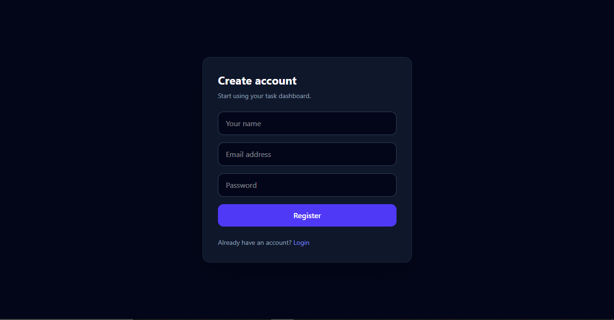
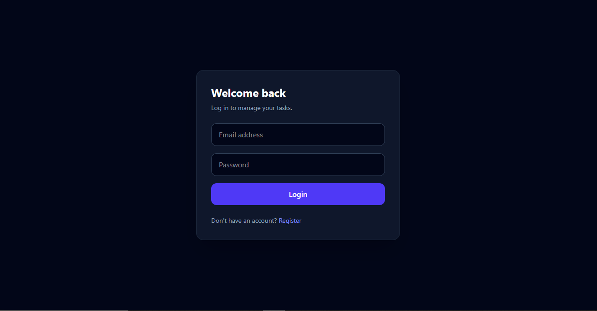
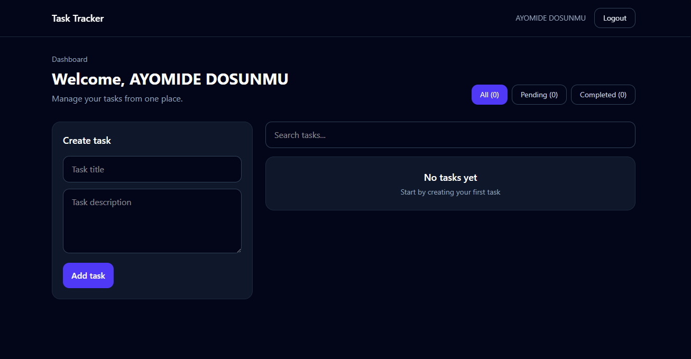
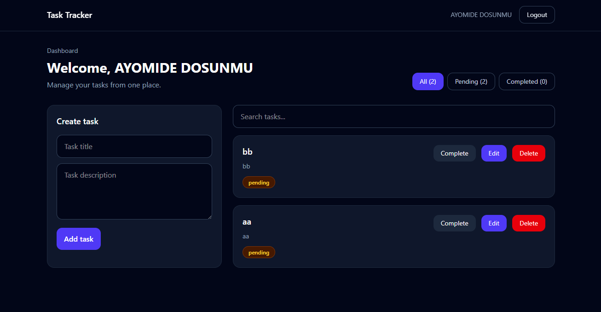
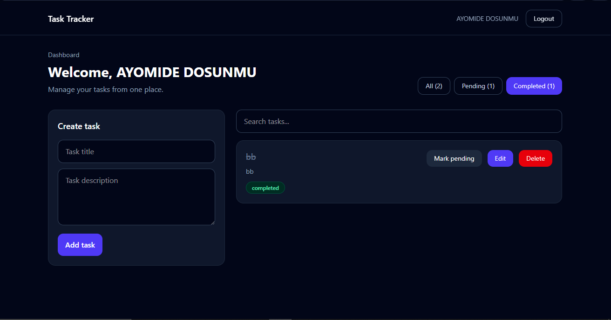
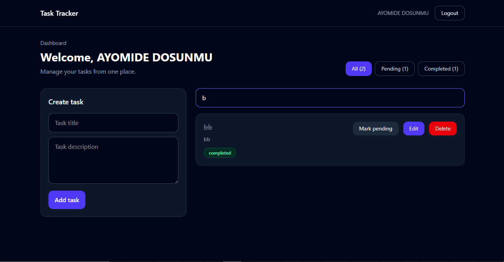
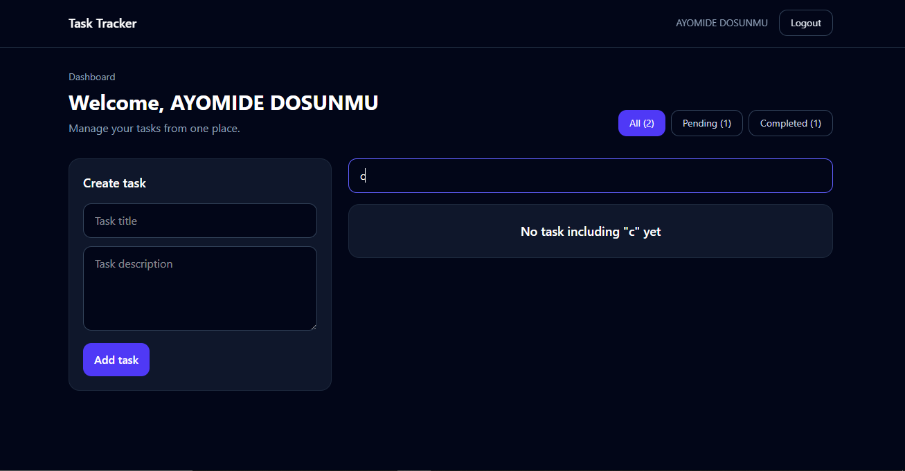

This project demonstrates my ability to build, secure, and deploy a fullstack MERN application with real-world production considerations.

# Taskly – Full Stack Task Management App

Taskly is a full-stack task management application that allows users to register, log in securely, create tasks, update them, mark them as completed, delete tasks, search tasks, and filter tasks by status.

The application uses JWT authentication, protected routes, MongoDB for data storage, and was fully deployed using Render (backend) and Vercel (frontend).

---

## Live Demo

Frontend:
https://taskly-two-tan.vercel.app/

Backend API:
https://taskly-sh5o.onrender.com/

---

## Features

### Authentication
- User registration
- User login
- JWT authentication
- Protected backend routes
- Protected frontend routes
- Persistent login using localStorage token storage
- Logout functionality

### Task Management
- Create task
- Update task
- Delete task
- Toggle task status (pending/completed)
- View all tasks
- Search tasks
- Filter tasks by:
  - All tasks
  - Pending tasks
  - Completed tasks

### User Experience
- Loading states
- Error handling
- Empty states
- Responsive dashboard UI
- Persistent authentication session

---

## Tech Stack

### Frontend
- React
- React Router DOM
- Context API
- Axios
- Tailwind CSS
- Vite

### Backend
- Node.js
- Express.js
- MongoDB
- Mongoose
- JWT Authentication
- bcryptjs

### Deployment
- Vercel (Frontend)
- Render (Backend)
- MongoDB Atlas (Database)

---

## Screenshots

### Register 

### Login 

### Dashboard (Empty Task list)

### Dashboard (All Task list)

### Dashboard (Completed Task list)

### Dashboard (Search Filter Found)

### Dashboard (Search Filter Not Found)

---

## API Endpoints

### Auth Routes
POST /api/auth/register  
POST /api/auth/login  
GET /api/auth/me  

### Task Routes
POST /api/tasks  
GET /api/tasks  
PUT /api/tasks/:id  
DELETE /api/tasks/:id  
PATCH /api/tasks/:id/status  

---

## Local Setup Instructions

### Clone repository

git clone https://github.com/Doswin5/taskly.git  
cd taskly  

---

### Backend setup

cd server  
npm install  

Create .env file:

PORT=5050  
MONGO_URI=your_mongodb_uri  
JWT_SECRET=your_secret_key  
CLIENT_URL=http://localhost:5173  

Run backend:

npm run dev  

---

### Frontend setup

cd client  
npm install  

Create .env file:

VITE_API_URL=http://localhost:5050/api  

Run frontend:

npm run dev  

---

## Production Challenges I Solved

### CORS Issues
Configured backend to allow Vercel frontend origin.

### Environment Variables
Debugged and properly configured Render environment variables.

### MongoDB Connection
Fixed database access issues by updating network access.

### Vercel Routing
Fixed SPA refresh 404 error using rewrite rules.

---

## Key Lessons Learned

- Fullstack architecture
- Authentication flow
- API integration
- Deployment workflows
- Debugging production issues
- Environment variable handling

---

## Future Improvements

- Due dates
- Drag and drop tasks
- Task categories
- Email notifications
- Password reset
- Social authentication

## Author

Built by Dosunmu Ayomide

Fullstack Developer focused on building and deploying production-ready web applications.

GitHub: https://github.com/Doswin5